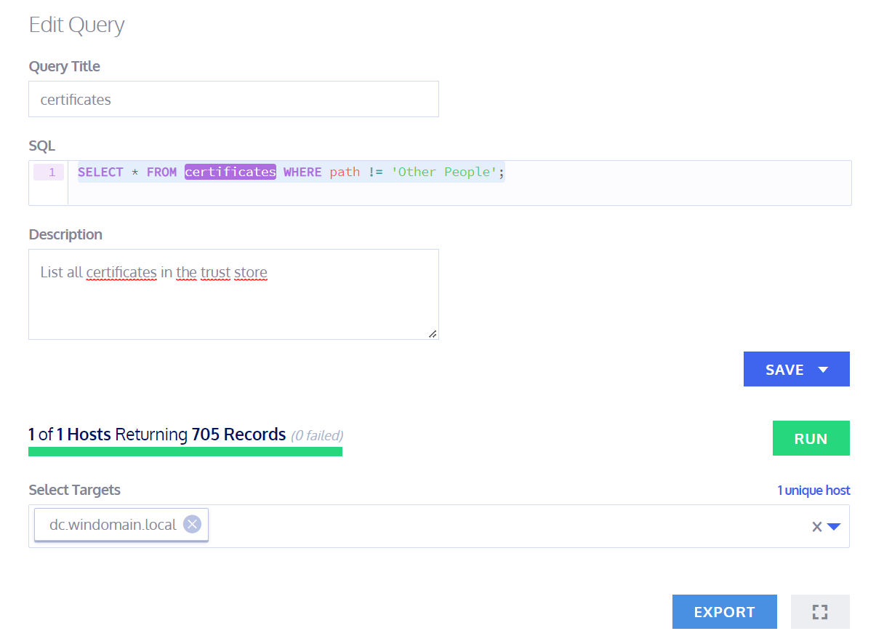
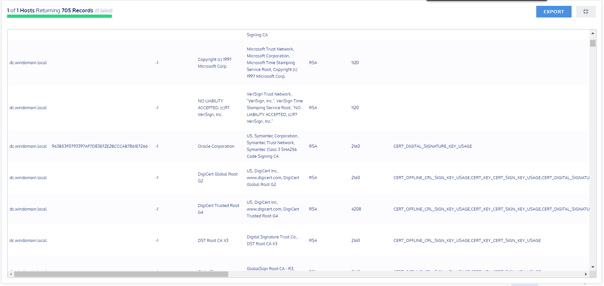
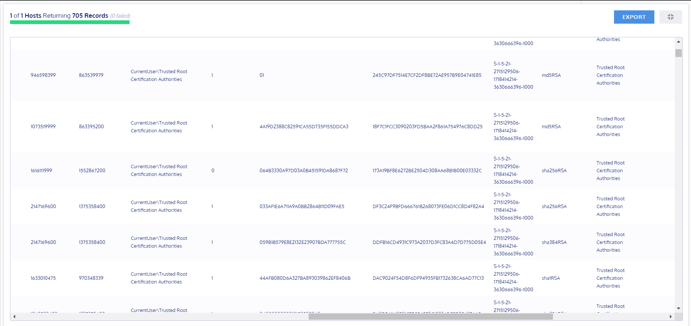
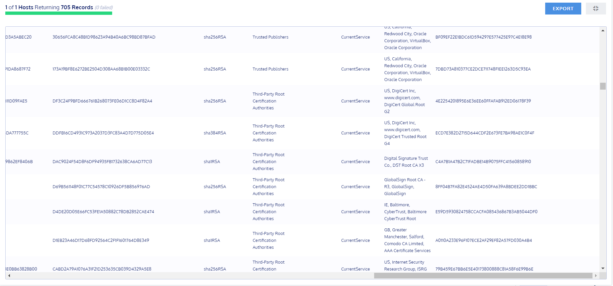
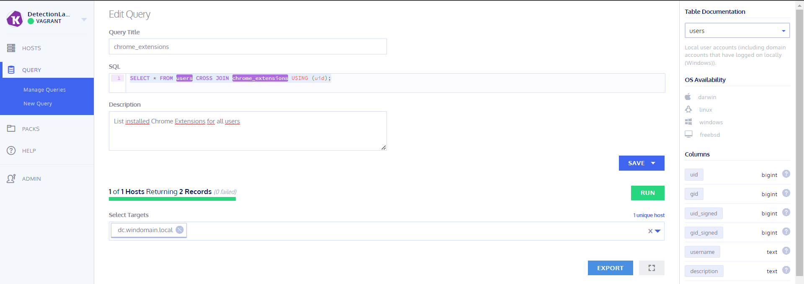
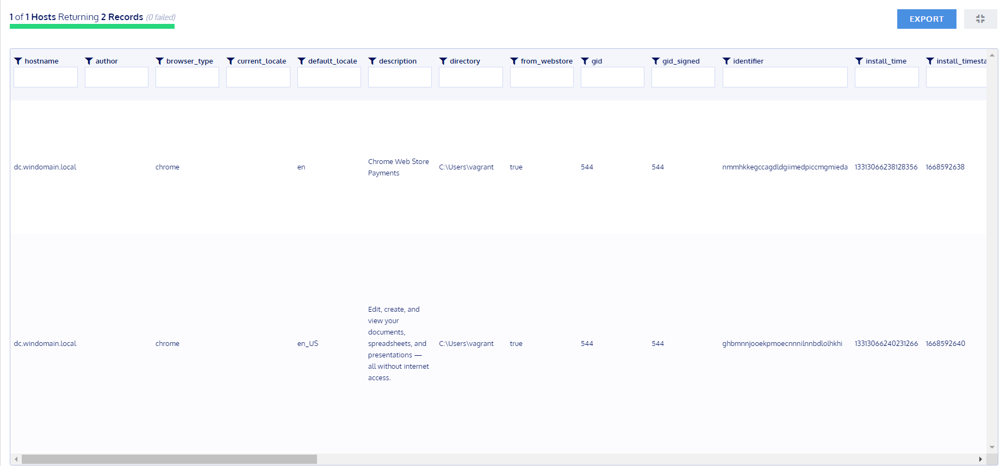
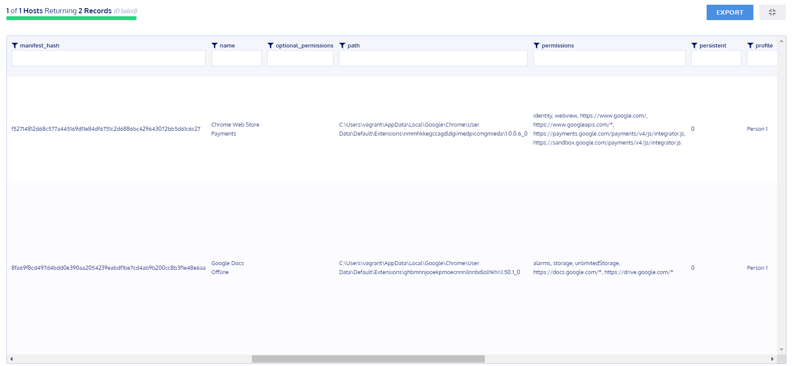
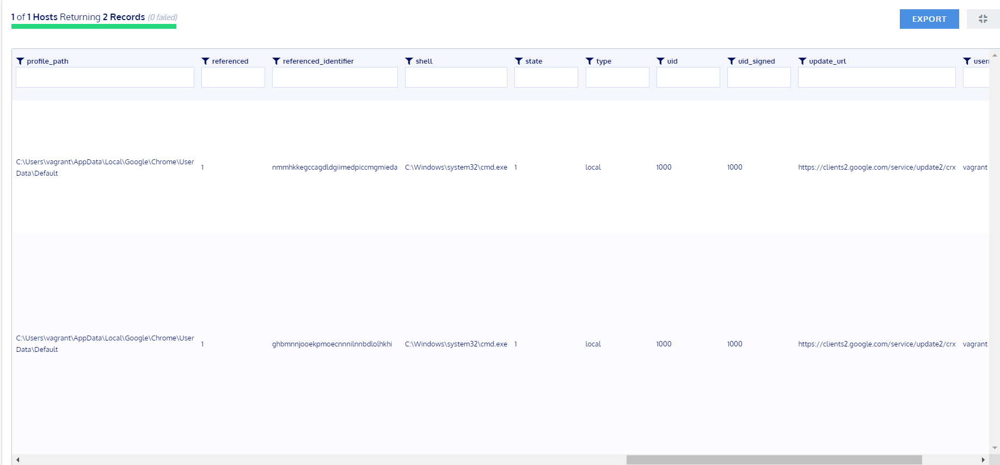
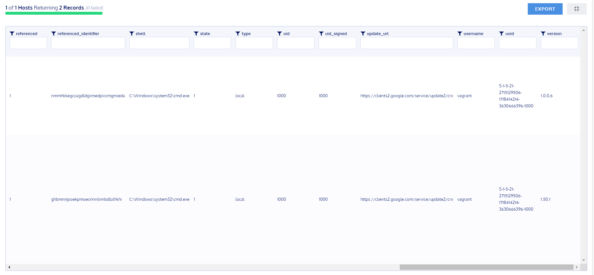

# Fleet Osquery Testing
## Recherche
### Was ist Fleet? Wofür wird es verwendet
Fleet ist eine Webapplikation zur Verwaltung und Überwachung von OSQuery Installationen auf mehreren Clients. Es wird verwendet, um die Verwaltung von OSQuery in grossen Umgebungen zu vereinfachen, indem Fleet eine zentralisierte und webbasierte Konfigurationsverwaltung, Überwachung und Protokollierung von OSQuery Abfragen bereitstellt.

Mit Fleet können Administratoren OSQuery Abfragen an eine Gruppe von Computern senden und die Ergebnisse in Echtzeit überwachen. Sie können auch OSQuery Konfigurationen für eine Gruppe von Clients gleichzeitig aktualisieren und sicherstellen, dass alle Clients eine einheitliche Konfiguration haben. Fleet wird in der Regel in grossen Unternehmensumgebungen verwendet, in denen es wichtig ist, die Sicherheit und Integrität von Netzwerken zu gewährleisten und zu überwachen.
### Was ist die aktuellste Version von Fleet?
Die aktuelle Version von Fleet ist 4.25.0 und kann unter folgendem Link heruntergeladen werden: [Download](https://github.com/fleetdm/fleet/releases)
### Was sind Beispiel-Anwendungen/Use-Cases bei welchen Fleet helfen kann?
Einige Beispiele für Anwendungen/Use-Cases, in denen Fleet nützlich sein kann sind (Server werden ebenfalls als Clients gezählt, da für die Server vieles anwendbar ist was auch für die Clients gilt):
1. Überwachung von Systemaktivitäten und Sicherheitsanomalien: Fleet kann dazu verwendet werden, um Abfragen an eine Gruppe von Clients zu senden, um Systemaktivitäten zu überwachen und potenzielle Sicherheitsrisiken aufzuspüren. Bspw. können Abfragen genutzt werden, um alle aktuell laufenden Prozesse auf allen Clients im Netzwerk abzufragen und nach "ungewöhnlichen" oder schädlichen Prozessen zu überwachen.
2. Überwachung von Netzwerkaktivitäten: Die Netzaktivitäten können überwacht werden und es können dadurch mögliche Bedrohungen identifiziert werden, indem die Weboberfläche von Fleet dazu genutzt wird spezifische Abfragen an eine Gruppe von Clients zu senden. Abfragen können z.B. dazu verwendet werden, um alle aktiven Verbindungen auf allen ausgewählten Clients im Netzwerk abzufragen und nach "unseriösen" oder schädlichen Verbindungen zu überwachen.
3. Überwachung von Benutzeraktivitäten: Zur Überwachung der Benutzeraktivitäten und um daraus potenziell resultierende Sicherheitslücken aufzudecken, kann Fleet ebenfalls Abfragen an Clients im Netzwerk versenden. (Die Nutzer müssen der Überwachung gewisser Ihrer Aktivitäten vorher Vertraglich zugestimmt haben, sonst illegal + strafbar) Zum Beispiel können Abfragen verwendet werden, um alle aktiven Benutzerkonten auf allen Computern im Netzwerk abzufragen und nach ungewöhnlichen oder schädlichen Benutzeraktivitäten zu überwachen. (Bspw. gewisse erwachsenen Webseiten besuchen)
4. Überwachung von Software-Updates und Patches: Fleet ist auch in der Lage, um Abfragen an Clients zu senden, um sicherzustellen, dass alle Clients im Netzwerk auf dem aktuellen Stand sind und alle relevanten Sicherheitspatches installiert haben. Bspw. die neusten Windows Updates oder Google Chrome Updates.
5. Überwachung von Hardware- und Systemleistung: Die Hardware- und Systemleistung kann ebenfalls mittels Fleet bei einer Gruppe von Clients abgefragt werden, um mögliche Probleme zu erkennen. Bspw. können Abfragen verwendet werden, um die Leistung von CPU, RAM und Festplatte auf allen Clients im Netzwerk zu überwachen und zu protokollieren.

Der Hauptvorteil von Fleet ist, dass OSQuery abfragen ohne grosse mühen an beliebig viele Clients gesendet werden können und danach auch relativ einfach auswertbar sind. Dies spart Zeit und somit auch Geld. 
## Dokumentation / Testing (1) 
### Suchen Sie sich eine Query aus die für Ihre Windows-Umgebung sinnvoll erscheint
Ich habe mich für die Query mit dem Namen certificates entschieden, da einige Dienste wie Elastic normalerweise Zeritifkatsbasiert arbeiten und es deshlab wichtig zu wissen ist welche Zertifikate die mit Elastic zusammenhängen installiert sind. Zudem ist es auch wichtig, dass man prüft, dass keine veralteten Zertifikate und vor allem welche Zertifikate installiert sind, besonders auf einem DC. Deshalb habe ich mich für diese Query entschieden. 
### Beschreiben Sie die Query ausführlich (Sinn / Zweck / Umsetzung der Abfrage)
Die Query zeigt nach ihrer Beschreibung folgende Zertifikate an: "List all certificates in the trust store", d.h. es werden alle Vertrauenswürdigen Zertifikate ausfgelistet (Auch Root CA). Dies dient dazu, dass man kein unerwünschten vertrauenswürdigen Zertifikate drin hat, da ansonsten gewisse unseriösen Verbindungen auf einmal Seriös werden, zudem kann man auch noch die Gültigkeit überprüfen und wenn ein Cert abgelaufen ist oder kurz davor entsprechend handeln.

Die Query für die Abfrage geht wie folgt:
```sql
# Es werden alle Zertifkate abgefragt bei denen der Pfad nicht gleich einem anderen User ist. Also alle meine vertrauenswürdigen Certs werden zurückgegeben
SELECT * FROM certificates WHERE path != 'Other People';
```

Die Query habe ich nur auf meinen DC angewandt, da ich nicht mehr VMs laufen lassen kann.

                      

### Testen Sie die Abfrage und dokumentieren Sie die Resultate (mit Printscreens)
Mit dem Reultat der Abfrage bin ich Zufrieden, mir werden alle vertrauenswürdigen Zertifikate angezeigt und wie lange Sie gültig sind. Zudem sehe ich auch noch den Thumbprint und die Anzahl Bit Verschlüsselung, wo es installiert ist (Pfad in der cert Verwaltung), wann es abläuft, welcher Hash und Verschlüsselung verwendet wird, sowie von wem es Ausgestellt wurde. Dies sind alle notwendigen Informationen auf einen Blick, der einzige Nachteil ist, dass es sehr viele Einträge generiert hat, bei mehrer Maschienen wird das dann Recht schnell unübersichtlich. Das Resulatet CSV findet man bei den Bildern. [Query Results (01-09-23 08-22-15).csv](Images/FleetOsqueryTesting/Query%20Results%20(01-09-23%2008-22-15).csv)                       

                                                                    
                                      
                                     

## Dokumentation / Testing (2) 
### Suchen Sie sich eine Query aus die für Ihre Windows-Umgebung sinnvoll erscheint
Ich habe mich für die Query mit dem Namen chrome_extensions entschieden, da es wichtig zu wissen ist, was user für chrome Extensions installiert haben. Manche User klicken zu schnell auf Install und OK auf einer Webseite und schon ist ein ADware Plugin installiert oder noch schlimmer. Persönlich bin sowieso ein verfechter von Browsern auf einem DC aber wenn dann sollte man wenigstens die Plugins im überblick haben.
### Beschreiben Sie die Query ausführlich (Sinn / Zweck / Umsetzung der Abfrage)
Die Query macht laut ihrer Beschreibung folgendes: "List installed Chrome Extensions for all users", d.h. ich sehe welcher User welches Plugin auf welchem Gerät installiert hat. Dies kann mir dabie helfen zu prüfen, ob schädliche oder veraltet Plugins installiert sind und ob diese mit Compliance Richtlinien der Organisation übereinstimmen.

Die Query Abfrage geht wie folgt:
```sql
# Es werden von allen Usern alle Chrome Extensions abgefragt und einander mit der uis zugeprdnet
SELECT * FROM users CROSS JOIN chrome_extensions USING (uid);
```

Auch diese Query habe ich nur auf meinen DC angewandt, da ich nicht mehr VMs laufen lassen kann.



### Testen Sie die Abfrage und dokumentieren Sie die Resultate (mit Printscreens)
Mit dem Resultat bin ich mehr als zufrieden, mir werden alle Plugins aller User angezeigt und wo diese Liegen. Zudem sehe ich auch noch in welchem Profil diese installiert sind, in welcher Version, auf welche Seiten das Plugin Rehcte hat, den Namen, den Installationszeitpunkt, den indentifier und in welchem Browser das Plugin installiert ist. Damit habe ich alle wichtigen Inforationen auf einen schlag erhalten, ich denke auch nicht, dass bei mehrern Hosts die Liste zu unübersichtlich wird. Das Resulatet CSV findet man bei den Bildern. [Query Results (01-09-23 08-52-42).csv](Images/FleetOsqueryTesting/Query%20Results%20(01-09-23%2008-52-42).csv)

                         
                          
                        
                                   
