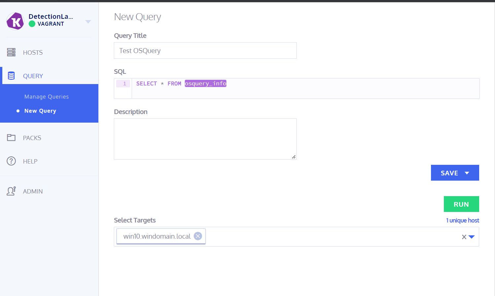
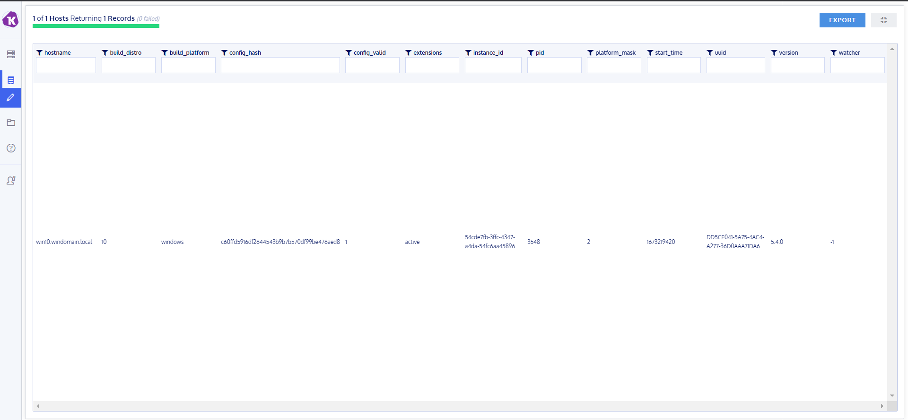

# Beschreibung der Software OSQuery
## Recherche
### Was ist OSQuery? Wofür wird es verwendet
OSQuery ist eine Open Source Software, die von Facebook entwickelt wurde und derzeit von der Community gepflegt und aktualisiert wird. OSQuery ermöglicht es, im ganzen Netzwerk Informationen auf verschiedenen Betriebssystemen abzufragen und zu analysieren. In der Regel wird OSQuery für die Sicherheitsüberwachung und -analyse verwendet, indem Administratoren durch OSQuery die Möglichkeit erhalten, Anomalien und Bedrohungen in Echtzeit zu erkennen und um darauf angemessen zu reagieren. OSQuery verwendet SQL Abfragen, um Informationen aus dem Betriebssystem abzufragen und zu analysieren, und bietet eine Reihe von vordefinierten Tabellen, welche Informationen wie laufende Prozesse, Netzwerkverbindungen, Benutzerkonten und vieles mehr enthalten. OSQuery kann auf verschiedenen Betriebssystemen wie Windows, macOS, Linux und FreeBSD ausgeführt werden.
### Was ist die aktuellste Version von OSQuery?
Die aktuelle Version von OSQuery ist 5.7.0 und kann unter folgendem Link heruntergeladen werden: [Download](https://github.com/osquery/osquery/releases)
### Was sind Beispiel-Anwendungen/Use-Cases bei welchen OSQuery helfen kann
Hier sind einige Beispiele für Anwendungen, bei denen OSQuery helfen kann:
1. Überwachung der Sicherheit: OSQuery kann verwendet werden, um Sicherheitsbedrohungen zu identifizieren und zu melden. Administratoren können z.B. Abfragen erstellen, um nach unerwarteten Prozessen, Netzwerkverbindungen oder Dateiänderungen zu suchen, welche möglicherweise das Ergebnis von Malware sind.
2. Überwachung von Compliance-Anforderungen: Mittels OSQuery kann sichergestellt werden, dass Clients in der Organisation bestimmte Compliance Anforderungen erfüllen. Z.B. könnten Administratoren Abfragen erstellen, um sicherzustellen, dass alle Computer über bestimmte Software- und Sicherheitsupdates verfügen. (Erhöht die Sicherheit in der Infrastruktur -> kein veraltetes Zeug)
3. Verwaltung von Systemkonfigurationen: Informationen über die Systemkonfiguration von Clients in einer Organisation können durch OSQuery gesammelt und dadurch verwaltet werden. Bspw. könnten Administratoren Abfragen erstellen, um die Hardwarekonfigurationen von Computern zu überwachen oder um sicherzustellen, dass bestimmte Software auf allen Computern installiert oder eben nicht installiert (z.B. WhatsApp, Instagram + co.) ist.
4. Auditing: Durch OSQuery können auch Audits von den Clientsystemen durchgeführt werden. Abfragen könnten z.B. von Administratoren erstellt werden, um Informationen über die Benutzeraktivität auf Clients in einer Organisation zu sammeln oder um Änderungen an Systemeinstellungen zu verfolgen. (Informationen zur Benutzeraktivität dürfen nur nach Schriftlichen/Vertraglichem Einverständnis des Users erfolgen ansonsten ist dies illegal und strafbar)
5. Überwachung von Netzwerkaktivitäten: Auf Clients können Netzwerkverbindungen durch OSQuery abgefragt und überwacht werden.  Dies kann Administratoren dabei helfen, unerwünschte Verbindungen zu identifizieren und zu verhindern. (Bspw. auf erwachsenen Seiten, Zalando, Social Media, durch Phishing auf eine Webseite geleitet)
6. Überwachung von Hardwareauslastung: Hardwareauslastungen wie CPU-Auslastung oder verfügbaren Speicherplatz können mittels OSQuery abgefragt und überwacht werden. Dies kann Administratoren dabei helfen, Engpässe zu identifizieren und möglichst Zeitnah zu beheben. (Wenn ein Fileserver erst dann erweitert wird, wenn er 0Byte Frei hat ist es zu spät)

OSQuery ist alles in allem ein nützliches Tool, um relativ einfach und gezielt bestimmte informationen schnell und genau abfragen zu können.  
## Konfiguration / Testing
### Dokumentieren Sie das Config-File welches auf Ihrem System für OSQuery installiert ist
Das Config File liegt unter "C:\Program Files\osquery" und heisst osquery.conf. In diesem File sind alle Relevaten Konfigurationen eingetragen, wie z.B. was immer an eine Query angefügt werden soll, die Schedule Queries, feature vectors usw.
```
{
  // Configure the daemon below:
  "options": {

    // The log directory stores info, warning, and errors.
    // If the daemon uses the 'filesystem' logging retriever then the log_dir
    // will also contain the query results.
    //"logger_path": "/var/log/osquery",

    // Set 'disable_logging' to true to prevent writing any info, warning, error
    // logs. If a logging plugin is selected it will still write query results.
    //"disable_logging": "false",

    // Splay the scheduled interval for queries.
    // This is very helpful to prevent system performance impact when scheduling
    // large numbers of queries that run a smaller or similar intervals.
    //"schedule_splay_percent": "10",
  },

  // Define a schedule of queries:
  "schedule": {
    // This is a simple example query that outputs basic system information.
    "system_info": {
      // The exact query to run.
      "query": "SELECT hostname, cpu_brand, physical_memory FROM system_info;",
      // The interval in seconds to run this query, not an exact interval.
      "interval": 3600
    }
  },

  // Decorators are normal queries that append data to every query.
  "decorators": {
    "load": [
      "SELECT uuid AS host_uuid FROM system_info;",
      "SELECT user AS username FROM logged_in_users ORDER BY time DESC LIMIT 1;"
    ]
  },

  // Add default osquery packs or install your own.
  //
  // There are several 'default' packs installed via
  // packages and/or Homebrew.
  //
  // Linux:        /opt/osquery/share/osquery/packs
  // OS X:         /var/osquery/packs
  // Homebrew:     /usr/local/share/osquery/packs
  // make install: {PREFIX}/share/osquery/packs
  //
  "packs": {
    // "osquery-monitoring": "/opt/osquery/share/osquery/packs/osquery-monitoring.conf",
    // "incident-response": "/opt/osquery/share/osquery/packs/incident-response.conf",
    // "it-compliance": "/opt/osquery/share/osquery/packs/it-compliance.conf",
    // "osx-attacks": "/var/osquery/packs/osx-attacks.conf",
    // "vuln-management": "/opt/osquery/share/osquery/packs/vuln-management.conf",
    // "hardware-monitoring": "/opt/osquery/share/osquery/packs/hardware-monitoring.conf",
    // "ossec-rootkit": "/opt/osquery/share/osquery/packs/ossec-rootkit.conf",
    // "windows-hardening": "C:\\Program Files\\osquery\\packs\\windows-hardening.conf",
    // "windows-attacks": "C:\\Program Files\\osquery\\packs\\windows-attacks.conf"
  },

  // Provides feature vectors for osquery to leverage in simple statistical 
  // analysis of results data. 
  //
  // Currently this configuration is only used by Windows in the Powershell
  // Events table, wherein character_frequencies is a list of doubles 
  // representing the aggregate occurrence of character values in Powershell 
  // Scripts. A default configuration is provided which was adapated from 
  // Lee Holmes cobbr project: 
  // https://gist.github.com/cobbr/acbe5cc7a186726d4e309070187beee6
  // 
  "feature_vectors": {
    "character_frequencies": [
      0.0,      0.0,      0.0,      0.0,       0.0,      0.0,      0.0,
      0.0,      0.0,      0.0,      0.0,       0.0,      0.0,      0.0,
      0.0,      0.0,      0.0,      0.0,       0.0,      0.0,      0.0,
      0.0,      0.0,      0.0,      0.0,       0.0,      0.0,      0.0,
      0.0,      0.0,      0.0,      0.0,       0.0,      0.00045,  0.01798,
      0.0,      0.03111,  0.00063,  0.00027,   0.0,      0.01336,  0.0133,
      0.00128,  0.0027,   0.00655,  0.01932,   0.01917,  0.00432,  0.0045,
      0.00316,  0.00245,  0.00133,  0.001029,  0.00114,  0.000869, 0.00067,
      0.000759, 0.00061,  0.00483,  0.0023,    0.00185,  0.01342,  0.00196,
      0.00035,  0.00092,  0.027875, 0.007465,  0.016265, 0.013995, 0.0490895,
      0.00848,  0.00771,  0.00737,  0.025615,  0.001725, 0.002265, 0.017875,
      0.016005, 0.02533,  0.025295, 0.014375,  0.00109,  0.02732,  0.02658,
      0.037355, 0.011575, 0.00451,  0.005865,  0.003255, 0.005965, 0.00077,
      0.00621,  0.00222,  0.0062,   0.0,       0.00538,  0.00122,  0.027875,
      0.007465, 0.016265, 0.013995, 0.0490895, 0.00848,  0.00771,  0.00737,
      0.025615, 0.001725, 0.002265, 0.017875,  0.016005, 0.02533,  0.025295,
      0.014375, 0.00109,  0.02732,  0.02658,   0.037355, 0.011575, 0.00451,
      0.005865, 0.003255, 0.005965, 0.00077,   0.00771,  0.002379, 0.00766,
      0.0,      0.0,      0.0,      0.0,       0.0,      0.0,      0.0,
      0.0,      0.0,      0.0,      0.0,       0.0,      0.0,      0.0,
      0.0,      0.0,      0.0,      0.0,       0.0,      0.0,      0.0,
      0.0,      0.0,      0.0,      0.0,       0.0,      0.0,      0.0,
      0.0,      0.0,      0.0,      0.0,       0.0,      0.0,      0.0,
      0.0,      0.0,      0.0,      0.0,       0.0,      0.0,      0.0,
      0.0,      0.0,      0.0,      0.0,       0.0,      0.0,      0.0,
      0.0,      0.0,      0.0,      0.0,       0.0,      0.0,      0.0,
      0.0,      0.0,      0.0,      0.0,       0.0,      0.0,      0.0,
      0.0,      0.0,      0.0,      0.0,       0.0,      0.0,      0.0,
      0.0,      0.0,      0.0,      0.0,       0.0,      0.0,      0.0,
      0.0,      0.0,      0.0,      0.0,       0.0,      0.0,      0.0,
      0.0,      0.0,      0.0,      0.0,       0.0,      0.0,      0.0,
      0.0,      0.0,      0.0,      0.0,       0.0,      0.0,      0.0,
      0.0,      0.0,      0.0,      0.0,       0.0,      0.0,      0.0,
      0.0,      0.0,      0.0,      0.0,       0.0,      0.0,      0.0,
      0.0,      0.0,      0.0,      0.0,       0.0,      0.0,      0.0,
      0.0,      0.0,      0.0,      0.0,       0.0,      0.0,      0.0,
      0.0,      0.0,      0.0
    ]
  }    
}
```
### Dokumentieren Sie die Struktur des Config-Files
Das Config File ist im JSON Format und best aus einen Objekten oder Arrays aus Objekten. Ein Objekt kann wieder ein Objekt enthalten, welches dann bspw. ein Array ist. Dadurch bleibt das File anders als bei wie ich finde XML deutlich übersichlicher und Strukturierter. Ich finde ebenfalls, dass die Logik des Aufbaus sehr kompakt, einfach und erweiterbar ist, wie ich es bei anderen sehr grossen Configs im Internet gesehen habe. Es gäbe noch eine vielzahl weitere Objekte/Konfigurationen die man hinzufügen könnte ohne die übersichtlichkeit zu gefährend. 
### Führen Sie einen ersten Test mittels OSquery durch und dokumentieren Sie das Resultat
Ich habe einen neuen Query gemacht, un den Win10 Host ausgewält. Bei dem Query habe ich als Resultat kleine Informationen über das OSQuery erhalten, welches installiert ist. Bspw. den Config hash. Ich habe aber auch einige Informationen über den Host erhalten, wie seine Interface MAC Adressen                                 
                                

