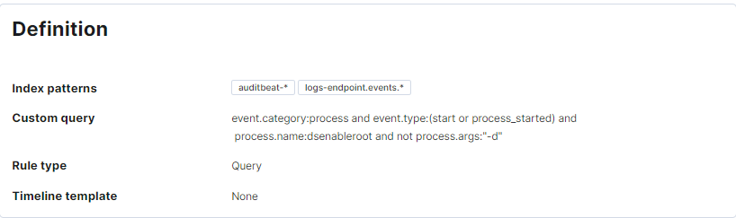

# Security Dashboards ELK
## Recherche
### Beschreiben Sie wie die Security Rules allgemein aufgebaut sind (mit Printscreens)
Die Rules sind so aufgebaut, dass man sie grob in 4 Bereiche unterteilen kann:
1. About: Im Abount findet man Allgemeine Informationen über die Regel, bspw. wer sie erstellt hat, eine kurze beschreibung wie schwerwiedgend sie ist, was sie für einen risk score hat, Refenz URLs, Informationen über falsch Positive Beispiele, Lizenzinformationen und die dann auch noch so eine Art Pfad was Parrent Bedrohungen sein können. Zudem hat eine Regel auch Tags, damit man sie einfacher findet. Nicht jede Regel hat genau gleich viele Informationen im About drin. 
                                     
2. Definition: In der Definition findet man einmal den Regeltyp, die meisten die ich bisher gesehn habe waren Query. Zudem hat es teilweise noch ein Timeline Template. Die Custom Query, mit welcher gesucht wird ist auch im Definition bereich sowi die Index Patterns, als die Dienste auf den Clients deren Index danach suchen soll.
                                  
3. Schedule: Im Schedule ist die Zeit eingestellt wie oft die Regel ausgeführt werden soll und eine Additional look-back time.
                                      
4. Alerts, Exceptions, Failure History: Hier findet man eine übersicht an den Alerts, welche auch bestätigt oder geschlossen werden können und man kann auch Aushanmen definieren, sowie sich die letzten 5 Fehler bei der Query ausführung anzeigen lassen..
                                                    

## Testing und Doku
### Suchen Sie sich ein Beispiel aus der Liste aus und dokumentieren Sie das Beispiel konkret (mit Printscreens)
Ich habe mich hier für die Endpoint Security Rule entschieden.
1. About: Die Rule von Elastic slebst erstellt und wurde vom Schweregrad las Mittel eingestuft. Hier ist nun auch noch ein schweregrad überschreibung da, welche den schweregrad an den aktuellen Risk score anpasst. Dieser Liegt derzeit bei 47 und deshalt hat die Rule die Severity Medium, wäre der score bei 99 würde Critical statt Medium stehen. Der Risk score wird je nach dem was die Geräte zurückgeben angepasst, er verweist also auf eine Callback Variable (event.risk_score verweist auf signal.rule.risk_score). Die Lizenz läuft unter Elastic License v2 und der Rule name overide ist auf den Wert message gesetzt und der Timestamp override auf die Variable event.ingested. Als Tag ist Elastic gesetzt und Endpoint Security.                        
   
2. Definition: Der Regeltyp ist eine Query und die Query arbeitet mit den Index Pattern logs-endpoint.alerts-*. Die Query hat eine andverknüpfung und noch eine abfrage in einer Klammer welche dann prüft, ob einer der Wert mit der Vriable event.module übereinstimmt. D.h. event.module und event.kind müssen beide true oder false sein.                     
                         
3. Schedule: Die Regel wird alle 5 Minuten ausgeführt und hat eine Additional look-back time von ebenfalls 5 Minuten.
   
4. Alerts, Exceptions, Failure History: Diese Regel hier hatte keine Alerts und Exeptions dafür aber 5 Last Five Errors und diese geben mir die Information, dass etwas beim Hinzufügen eines Host nicht funktioniert hat.
   

### Versuchen (und dokumentieren Sie den Versuch!) einen Alert für Ihre Rule zu generieren (mit Printscreens)
Konnte nicht umgesetzt werden, da keine Daten vom Host auf den Server kamen.