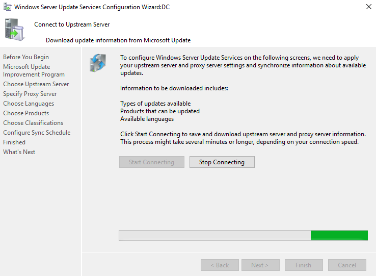

# Installation, Konfiguration und Testing von WSUS
## Recherche
### Wofür wird der WSUS-Dienst verwendet?
Der WSUS-Dienst (Windows Server Update Services) ist ein Feature, welches typischerweise auf einem Windows Server installiert wird und dazu verwendet wird, um Updates und Patches für Microsoft Produkte (Software und OS) bereitzustellen. Mit WSUS können Administratoren die Verteilung von Updates und Patches innerhalb einer Organisation steuern und sicherstellen, dass alle Systeme im Unternehmen auf dem neuesten Stand sind. WSUS ermöglicht es Administratoren auch, die Verteilung von Updates und Patches zu planen und zu verzögern, um sicherzustellen, dass diese nicht mit kritischen Geschäftsprozessen in Konflikt geraten.
### Welche Alternativen gibt es für den WSUS-Dienst?
Die nachfolgenden Tools sind nur einige von vielen alternativen zum WSUS, die meisten bieten sogar noch umfangreichere Funktionen:
- SolarWinds Patch Manager
- ManageEngine Patch Connect Plus
- Kaseya VSA
- PDQ Deploy
- Ivanti PatchLink
- BatchPatch
- Heimdal
- SanerNow
- NinjaOne
- Jetpatch
- Automox
- Action1
- Jumpcloud
- GFI LanGuard
- Atera’s Patch Management
- ...

### Welche Powershell-Cmdlets gibt es, um den WSUS-Dienst zu konfigurieren/steuern?
Eine Liste der aktuellen PowerShell Cmdlets findet man unter diesem Link: [Micrsoft PowerShell Cmdlets](https://learn.microsoft.com/en-us/powershell/module/updateservices/)
## Installation Server
### Dokumenation der Installation
Zuerst muss eine PowerShell als Administrator geöffnet werden und danch muss folgender Befehl eingegeben werden, um den WSUS Server mit allen Funktionen und Management Tools zu installieren:
```powershell
Install-WindowsFeature -Name UpdateServices -IncludeManagementTools
```

Anschlissend wird per PowerShell Konsole festgelegt, wo der WSUS Server seine Daten ablegen soll. Im Idealfall sollte dies ein separates Laufwerk sein, da je nach Menge der ausgewählten Komponenten, von denen er die Updates laden soll eine Menge Daten zusammenkommen. Bei der Installation unter C:\ könnte dies bei mangelndem Speicherplatz zu Performance einbrüchen, Systemabstürzen oder Systemausfällen kommen. Ich habe mich dazu entschieden mit dem Nachfolgenden PS Command im Laufwerk W für WSUS im Ordner WSUS die Daten zu speichern:
```powershell
& 'C:\Program Files\Update Services\Tools\WsusUtil.exe' postinstall CONTENT_DIR=W:\WSUS
```

#### Konfiguration
Beim ersten öffnen des Wsus öffnet sich auch gleich der Konfigurations Wizard. Falls man später Änderungen vornehmen möchte kann man dies unter den Options im Wsus tun.

1. Zuerst klickt man auf next                           
                           
2. Hier darf der Hacken nicht drin sein, das geht MS nix an                           
                           
3. Hier wählen wir Synchronize from Microsoft Update, da wir keinen anderen Wsus haben                           
                           
4. Hier muss der Hacken draussen sein, da wir keinen Proxy Server im einsatz haben                           
                           
5. Hier muss man einmal auf Start Connecting für einen einen ersten abgleich drücken, je nach Server Power kann dies sehr lange dauern                           
                           
                           
6. So sieht es aus, wenn er fertig synchronisert hat und dann klickt man auf Next                           
                                     
7. Hier habe ich nur English ausgewählt, da wir nur Englishe Server und Clients haben                           
                           
8. Bei den Products habe ich mich auf diejenigen Beschränkt, welche wirklich benötigt werden                           
                           
9. Bei den Classifications habe ich alle ausgewähltm wass ich downloaden möchte                           
                           
10. Beim Syncshedule habe ich eingestellt, dass er Stündlich synchronisieren soll, damit der Server immer möglichst die neuesten Updates herunterlädt                           
                           
11. Nun setzt man hier den hacken bei Begin initial synchronisation und klickt auf next                           
                           
12. Nachdem der Setupwizard nun durch ist kann ich auf Finish klicken.                           
                            
13. Bei den Computer Groups habe die Group Client und Server erstellt, damit dort später per GPO die Server und Clients zugewiesen werden                                        
                                                                  
14. Nun geht man im Wsus unter Options und wählt Computers aus                                    
                                                                          
15. Hier wählt man nun Use Group Policy or registry setting on computers aus, damit die Clients die computer group per GPO zugewiesen werden können                                             
                                       

### Dokumenation und Recherche der wichtigsten Optionen
Die wichtigsten Optionen sind nach meinen Recherchen folgende:                       
1. Language, die Sprachen die ich Synchronisiere sind wichtig, da ich um Speicher unf Traffic klein zu halten nur die wählen sollte, die ich wirklich brauche                                                                                    
                               
2. Products, bei den Products sollte man nur die auswählen, die man wirklich im einsatz hat, bspw. keine Windows XP mehr oder Office 2003                          
                                   
3. Classifications, wie auch bei den anderen Punkten solle man hier nur die auswählen, welche man wirklich braucht und als sinnvoll erachtet                           


Alle 3 können unter den Options im Wsus nachträglich angepasst werden

### Begründetbe Entscheide für die Wahl der Optionen (z.Bsp. bei der Auswahl der Pakete)
1. Ich habe mich nur für English entschieden, da alle Server nur mit English installiert sind, alles andere wäre unnötig gewesen
2. Bei den Products habe ich die betroffenen Windows Versionen ausgewählt und die Module/Tools die installiert/verwendet sind und von MS Supported werden bspw. .NET oder Active Directory
3. Bei den Classifications wollte ich zuerst alles auswählen, da ich es wichtig finde dass alles gepatch wird. Die Treiber habe ich jedoch dann aussen vor gelassen, da dies bei mir in der Vergangenheit immer wieder zu Problemen geführt hat.

## Installation Client
### Dokumenation der Konfiguration
1. Zuerst wird ein neue GPO erstellt und mit der Workstation OU verknüpft                            
                   
2. Nun wird unter "Computer Configuration>Policies>Administrative Templates>Windows Components>Windows Update" Configure Automatic Updates konfiguriert                               
                           
3. Wir setzen die Policy auf Enabled und stellen "Configure automatic update" auf 4, damit er die Updates herunterlädt und zu einem gewissen Zeitpunkt installiert. Danach wird bei Scheduled install day 0 ausgewaählt, damit die Updates nie zu lange dauern und bei install time 17:00, damit keine Geschäftsprozesse behindert werden. Ebenfalls wurde der Hacken bei Install updates for other Microsoft products gesetzt, damit auch bspw. Office aktualisiert werden würde.                     
                             
4. Nun wird als nächstes unter "Computer Configuration>Policies>Administrative Templates>Windows Components>Windows Update" Specify intranet Microsoft update service location konfiguriert                     
                  
5. Die Ploiciy wird auf einbaled gesetzt und ich habe überall den dc mit seinen FQDN und dem Port 8530 angegeben, damit der Client dort die Updates holt. Wenn man zwei Wsus hat könnte man als alterate einen anderen angegeben.                     
                               
6. Als nächstes wird unter "Computer Configuration>Policies>Administrative Templates>Windows Components>Windows Update" Enable client-side targeting konfiguriert, damit der Client beim WSUS Server direkt in die Richtige Gruppe kommt.                     
                   
7. Die Policy wird auf Enabled gesetzt und als Traget group name for this computer wird Clients ausgewählt, da die Computer Group im Wsus so heisst, der die Clients zugewiesen werden sollen                
                           
8. Nun muss der Client neu gestartet werden, damit die Policy Richtlinien aktiv sind

### Welche Powershell-Cmdlets gibt es, um den WSUS-Client zu konfigurieren/steuern
Dies ist leider das einzige Powershell-Cmdlet: (WindowsUpdate)[https://learn.microsoft.com/en-us/powershell/module/windowsupdate/?view=windowsserver2022-ps]

## Testing und Reporting
### Testen Sie die Update-Funktionalität
1. Bei den nachfolgenden beiden Screenshots sieht man, dass der Client die Updates von einem Server holt (Some settings are manages by your organization) und wartet bis es 17:00 Uhr ist, um Sie anschliessend zu installieren                                 
                                               
                          
2. Hier sieht man, dass der Client automatisch per GPO der Richtig computer group zugewiesen wurde
                        

### Welche Reports können aus dem WSUS über die GUI erstellt werden
Nachfolgend finden Sie den Screenshot der Reportsliste und deren Bedeutung:                         

