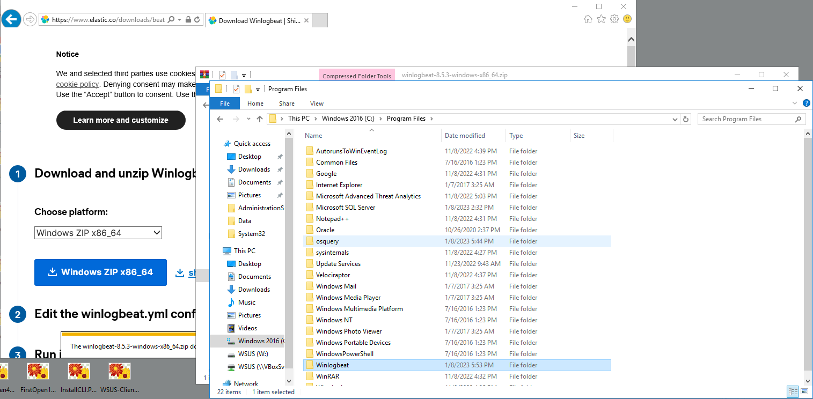
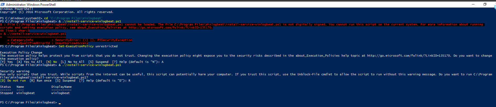
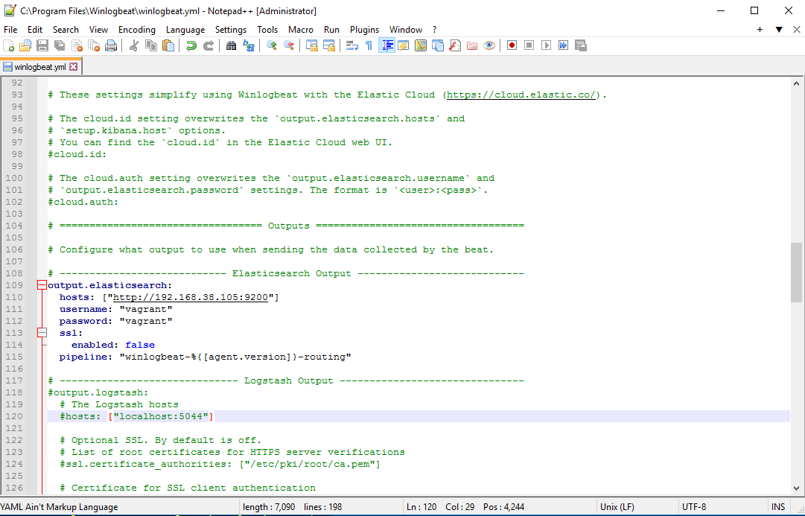
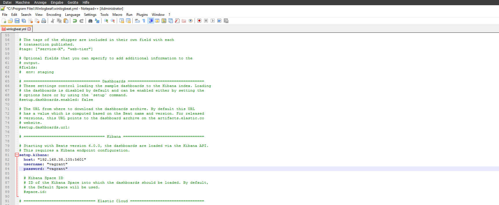
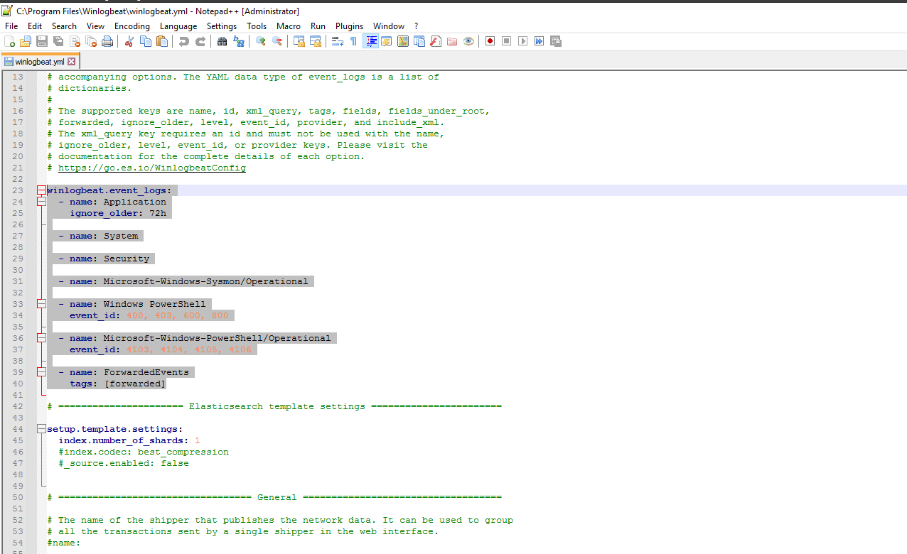
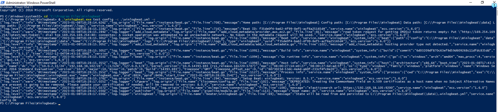
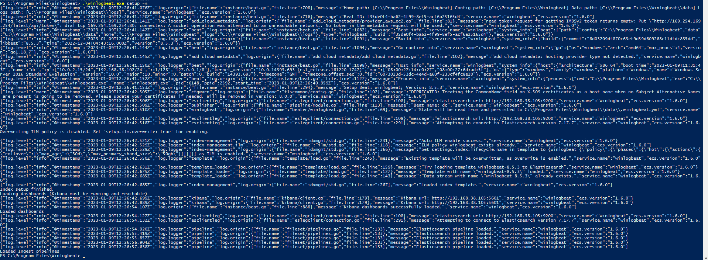
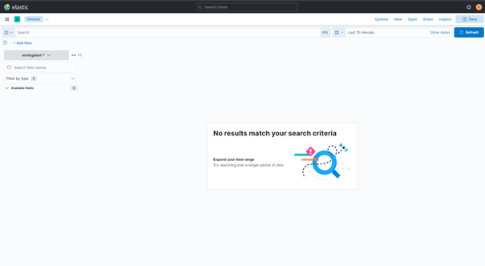

# Installation Winlogbeat
## Recherche
### Was ist Winlogbeat? Wofür wird es verwendet
Winlogbeat ist ein Open-Source-Programm zum Sammeln und Senden von Windows-Ereignisprotokollen. Es ist Teil von Elastic Stack, einer Reihe von Open-Source-Tools zur Verarbeitung und Analyse grosser Datenmengen. Winlogbeat wird häufig verwendet, um kritische Systemereignisse und Sicherheitswarnungen von Windows-Servern und -Clients zentral zu sammeln.
### Was ist die aktuellste Version von Winlogbeat?
Die aktuelle Version von Winlogbeat ist 8.5.3 und diese kann unter folgendem Link heruntergeladen werden: [Download](https://www.elastic.co/de/downloads/beats/winlogbeat)
## Installation
### Dokumentation der Installation Winlogbeat (mit Printscreens)
1. Herunterladen von Winlogbeat [Download](https://www.elastic.co/downloads/beats/winlogbeat)
2. Nach "C:\Program Files" entpacken
3. Ordner in "C:\Program Files" Umbenennen von winlogbeat-8.5.3-windows-x86_64 zu Winlogbeat              
               
4. PowerShell als Admin öffnen und folgenden Befehl ausführen, um den Winlogbeat Dienst zu registrieren/installieren
```powershell
cd 'C:\Program Files\Winlogbeat'
& .\install-service-winlogbeat.ps1
```
- Falls folgender Fehler Auftritt muss der nachfolgende Befehl ausgeführt werden, damit Scripts die nicht Signiert sind zugelassen werden:
        ```powershell
        Fehler:
        & : File C:\Program Files\Winlogbeat\install-service-winlogbeat.ps1 cannot be loaded. The file C:\Program Files\Winlogbeat\install-service-winlogbeat.ps1 is not digitally signed. You cannot run this script on the current system. For more information about running scripts and setting execution policy, see about_Execution_Policies at http://go.microsoft.com/fwlink/?LinkID=135170.
        At line:1 char:3
        + & .\install-service-winlogbeat.ps1
        +   ~~~~~~~~~~~~~~~~~~~~~~~~~~~~~~~~
            + CategoryInfo          : SecurityError: (:) [], PSSecurityException
            + FullyQualifiedErrorId : UnauthorizedAccess                                                                                                                                                                                                                        
        
        Lösung (Mit A den Befehl bestätigen und bei der erneuten Skript ausführung R für Run once auswählen):
        Set-ExecutionPolicy unrestricted
        ```

                                                        
5. Folgendes muss im File winlogbeat.yml unter "C:\Program Files\Winlogbeat" ersetzt werden
```yaml
Vorher Elastic:
output.elasticsearch:
  # Array of hosts to connect to.
  hosts: ["localhost:9200"]

  # Protocol - either `http` (default) or `https`.
  #protocol: "https"

  # Authentication credentials - either API key or username/password.
  #api_key: "id:api_key"
  #username: "elastic"
  #password: "changeme"

  # Pipeline to route events to security, sysmon, or powershell pipelines.
  pipeline: "winlogbeat-%{[agent.version]}-routing"

Nachher Elastic:
output.elasticsearch:
  hosts: ["http://192.168.38.105:9200"]
  username: "vagrant"
  password: "vagrant" 
  ssl:
    enabled: false

Vorher Kibana:
setup.kibana:

# Kibana Host
# Scheme and port can be left out and will be set to the default (http and 5601)
# In case you specify and additional path, the scheme is required: http://localhost:5601/path
# IPv6 addresses should always be defined as: https://[2001:db8::1]:5601
#host: "localhost:5601"

Nachher Kibana:
setup.kibana:
  host: "192.168.38.105:5601"
  username: "vagrant"
  password: "vagrant"
```
                                               
                                               
6. Folgendes kann im File winlogbeat.yml unter "C:\Program Files\Winlogbeat" konfiguriert werden. (Dort wird bestummen, was geloggt wird default ist Application, Security, System. Ich habe es auf den Default Enstellungen belassen):
```yaml
winlogbeat.event_logs:
  - name: Application
    ignore_older: 72h

  - name: System

  - name: Security

  - name: Microsoft-Windows-Sysmon/Operational

  - name: Windows PowerShell
    event_id: 400, 403, 600, 800

  - name: Microsoft-Windows-PowerShell/Operational
    event_id: 4103, 4104, 4105, 4106

  - name: ForwardedEvents
    tags: [forwarded]

Optional (Man kann Winloagbeat dazu veranlassen Logfiles zu schreiben)
logging.to_files: true
logging.files:
  path: C:\ProgramData\winlogbeat\Logs
logging.level: info
```

7. Nun kann die Konfiguration im PowerShell mit folgendem Befehl testen, man muss dafür im Porgrammverzeichnis von Winlogbeat sein und um Rechteprobleme zu vermeiden sollte man die PowerShell als Admin starten:
```powershell
cd 'C:\Program Files\Winlogbeat'
& .\winlogbeat.exe test config -c .\winlogbeat.yml -e
```

8. Der nachfolgende Befehl setzt Winloagbeat mit den getroffenen Einstellungen auf, man muss dafür im Porgrammverzeichnis von Winlogbeat sein und um Rechteprobleme zu vermeiden sollte man die PowerShell als Admin starten:
```powershell
cd 'C:\Program Files\Winlogbeat'
.\winlogbeat.exe setup -e
```
                      

### Dienst Starten/Stoppen
```powershell
# Starten: 
Start-Service winlogbeat

# Stoppen:
Stop-Service winlogbeat
```
## Dokumentation / Testing
### Dokumentieren Sie den Erfolg von Ihrer Installation ("sehen Sie Events von Ihrem Windows Rechner auf ELK"), mit Printscreens
Leider kamen bei mit im Elastic keine Events an trotz mehrfachen versuchen und Config anpassungen:                
                      
